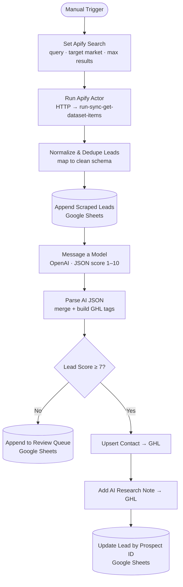

<div align="center">

# 🎯 Apify Lead Scrape → AI Score → GoHighLevel

**An [n8n](https://n8n.io) workflow that turns one search query into qualified, AI-scored CRM leads.**

Scrape business leads with **Apify**, score them with **OpenAI**, log everything to
**Google Sheets**, and push only the winners into **GoHighLevel** — fully automated.

[](LICENSE)
[](https://n8n.io)
[](../../actions/workflows/validate.yml)
[](CONTRIBUTING.md)

</div>

---

## ✨ What it does

- 🔎 **Scrapes** business leads from a search query via an Apify Actor task
- 🧹 **Normalizes & de-duplicates** messy scraper output into a clean, consistent schema
- 🧠 **Scores** each lead 1–10 with OpenAI and writes research fields (fit, pain point, pitch…)
- 📊 **Logs** every lead to Google Sheets as a staging + audit + review queue
- 🚀 **Pushes** only qualified leads (score ≥ 7) to GoHighLevel as contacts
- 📝 **Attaches** an AI research note to each pushed contact and writes the result back to the sheet

No code to deploy — import one JSON file into n8n, set a few environment variables, and run.

---

## 🗺️ How it works



### Scoring rubric

| Score | Meaning | Action |
|:---:|---|---|
| **9–10** | Strong fit — clearly needs the service | ✅ Push to GHL |
| **7–8**  | Good fit | ✅ Push to GHL |
| **5–6**  | Possible fit, needs a human | 🔍 Review queue |
| **1–4**  | Weak / irrelevant | 🔍 Review queue |

Only leads scoring **≥ 7** are sent to the CRM; everything else stays in the sheet for review.

---

## 🚀 Quick start

```bash
git clone https://github.com/IbrahimMalick/ApifyLead_AIScore_GHL-Workflow.git
cd ApifyLead_AIScore_GHL-Workflow
cp .env.example .env        # then fill in your values
```

1. **Import** `workflows/Exercise_1_Apify_Lead_Scrape_to_AI_Score_to_GHL.json` into n8n
   (*Workflows → Import from File*).
2. **Set environment variables** (`APIFY_TOKEN`, `APIFY_ACTOR_TASK_ID`,
   `GOOGLE_SHEET_ID`, `GHL_API_TOKEN`, `GHL_LOCATION_ID`).
3. **Connect credentials** in n8n: Google Sheets (OAuth2) + OpenAI (API key).
4. **Prepare the sheet** — a `Prospects` tab with the documented columns.
5. **Run** — edit *Set Apify Search* and execute.

📖 Full instructions: **[docs/SETUP.md](docs/SETUP.md)** ·
🎨 Make it your own: **[docs/CUSTOMIZATION.md](docs/CUSTOMIZATION.md)**

---

## 📦 Requirements

| Service | Used for |
|---|---|
| [n8n](https://n8n.io) (self-hosted or cloud) | Runs the workflow |
| [Apify](https://apify.com) | Lead scraping (Actor task) |
| [OpenAI](https://platform.openai.com) | Lead scoring (`gpt-4o-mini`) |
| [Google Sheets](https://sheets.google.com) | Staging, review queue, audit log |
| [GoHighLevel](https://www.gohighlevel.com) | CRM destination |

---

## 📁 Repository layout

```
.
├── workflows/      # the importable n8n workflow JSON
├── docs/           # SETUP.md + CUSTOMIZATION.md
├── scripts/        # validate_workflow.py (used by CI)
├── .github/        # issue/PR templates + validation workflow
├── .env.example    # required environment variables
├── CONTRIBUTING.md · SECURITY.md · CODE_OF_CONDUCT.md · CHANGELOG.md
└── LICENSE         # MIT
```

---

## 🔐 Security

This repo ships **zero live credentials** — every secret is a `{{$env.*}}` reference or
an n8n credential. CI scans every commit for leaked tokens.

- Keep your real `.env` out of git (already covered by `.gitignore`).
- If a token was ever committed or shared, **rotate it**.
- See **[SECURITY.md](SECURITY.md)** to report a vulnerability.

---

## 🤝 Contributing

Issues and PRs are welcome — see **[CONTRIBUTING.md](CONTRIBUTING.md)** and the
[Code of Conduct](CODE_OF_CONDUCT.md).

## 📄 License

[MIT](LICENSE) © Ibrahim Malick
